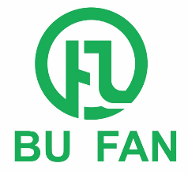

## 卜凡学院-公开课
公开课代码,欢迎fork和star

- __002 Netty__

    Netty权威指南-承载百万长连接解决方案.

For more details, see [课程列表](https://bfxy.ke.qq.com/#tab=1&category=-1).

## About us
卜凡学院是一家专门面向中高端技术人才培养的在线教育培训机构与技术服务支持，公司旨在于帮助中高端技术人员提高在互联网行业的竞争力。学院内所有课程均由一线互联网公司技术大牛精心研发，汇集多年工作积累，让您站在巨人的肩膀上快速成长。

## 我们的理念
我们拒绝基础（LOW）课程，我们抵制HELLO WORLD，!
我们的授课导师均为BAT、TMD 一线大厂互联网公司架构师、技术专家、在技术领域沉浸10年以上的架构设计、项目实战经验！

## 我们的目标
- __编码规范、编码水平、异常敏感度：__

    也就是说，你再实现一个功能的时候，要对这个功能的业务有充分理解的前提，是要编码精益求精，对各种各类异常（代码级别异常、业务级别异常）的可能出现都有进行捕获和处理，然后还有能想到以后如何扩展和可行性，以及高并发、故障情况等特殊环境下如何去做到功能的健壮性和高性能！

- __夯实基础知识、底层源码阅读__

    基础知识，这个是互联网大厂考察的必要点，什么算是基础呢？ 就是有关这个技术的基础点，细节点，学习不是仅仅会使用而已，而是要对API非常的了解，后期要学习阅读底层源码，知其所以然，然后再这个基础之上才能写出更好的代码！

- __扩展知识、架构思维模式__

    很多时候，说去扩展一个技术点，并不是很简单的，而是在了解这个技术的底层架构之后，针对于具体的业务去扩展的，所以在这之前，我们要有一个架构思维的培养和认知！比如高可靠、高可用、一致性、各种基础理论和发展原理，比如BASE、CAP等等都要有一个了解，当然这些仅仅是建立在表面层次，如何能够把这些概念运用到实战中去，代码中去，以及架构设计中去才是我们学习的重点！我们能给大家提供的不仅仅是表面的API学习和表面的理论概念，而是通过实战项目去磨炼！

## Connect with us

- **QQ**: 524423112
- **课程列表**: [腾讯课堂](https://bfxy.ke.qq.com/#tab=3&category=-1)
- **微信公众号**: 

## License
TiDB is under the MIT License . See the [LICENSE](./LICENSE) file for details.
